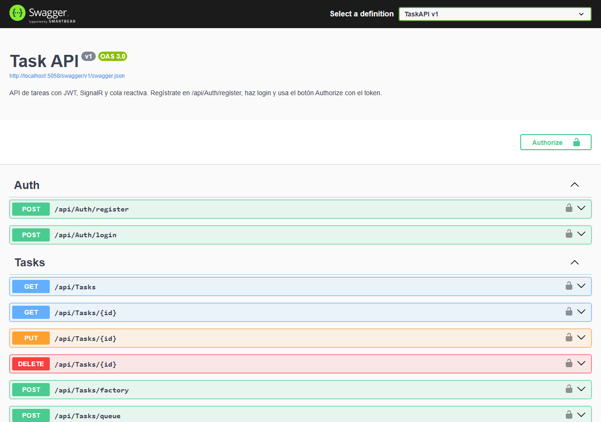
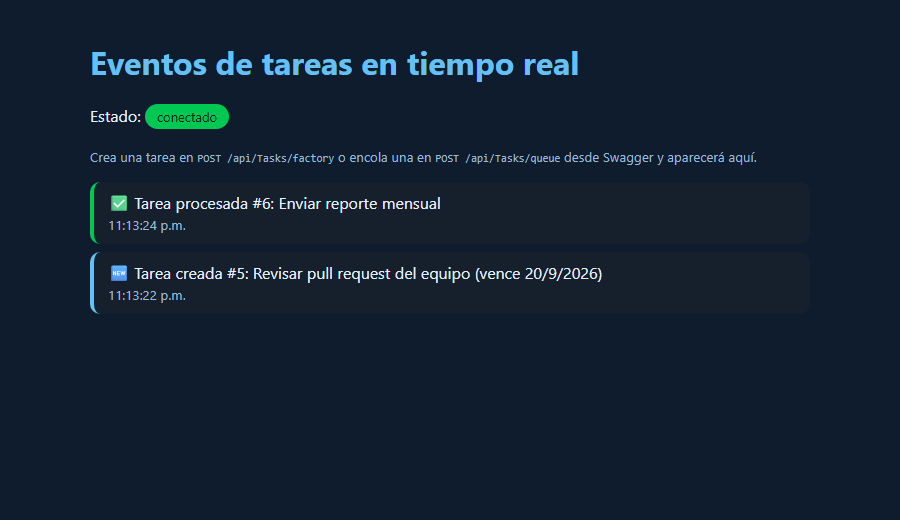

# TaskAPI

API REST de tareas en ASP.NET Core 8 con autenticación JWT, notificaciones en tiempo real por SignalR y una cola de procesamiento reactiva con System.Reactive. Incluye pruebas unitarias con xUnit.



## Funcionalidades

- Registro e inicio de sesión con contraseñas hasheadas (`PasswordHasher`) y tokens JWT de una hora
- CRUD de tareas protegido con `[Authorize]`: sin token la API responde 401
- `GET /api/Tasks?pendientes=true` para listar solo las tareas no completadas
- Creación mediante patrón Factory con validación por delegado (descripción obligatoria y fecha futura)
- Cola reactiva: `POST /api/Tasks/queue` guarda la tarea, la encola y la procesa en segundo plano
- Eventos SignalR `TareaCreada` y `TareaProcesada` para cualquier cliente conectado al hub
- Middleware global de errores que responde JSON con 400 o 500 según el tipo de excepción
- Memoización de cálculos repetidos (días restantes hasta la fecha límite)
- Swagger con botón Authorize para probar todo desde el navegador
- Modo de base de datos en memoria para correr la API sin instalar SQL Server

## Eventos en tiempo real

Página incluida en `wwwroot/signalr.html`, conectada al hub y recibiendo los eventos de una tarea creada y otra procesada por la cola:



## Stack

- ASP.NET Core 8, Entity Framework Core 9 (SQL Server o en memoria)
- JWT Bearer, SignalR, System.Reactive, Swashbuckle
- xUnit con `EntityFrameworkCore.InMemory` para las pruebas

## Cómo ejecutarlo

Necesitas el SDK de .NET 8 o superior.

```bash
git clone https://github.com/MarioMahir/TaskAPI.git
cd TaskAPI

# La clave JWT no está en el repositorio: configúrala con user-secrets (mínimo 32 caracteres)
dotnet user-secrets set "JwtSettings:Key" "una-clave-larga-y-secreta-de-al-menos-32-caracteres" --project TaskAPI

dotnet run --project TaskAPI
```

Abre http://localhost:5058/swagger. La cadena de conexión en `appsettings.json` apunta a SQL Server local (`Server=localhost;Database=TaskAPIDb`) y las migraciones están incluidas:

```bash
dotnet ef database update --project TaskAPI
```

Si no tienes SQL Server, corre con la base en memoria (los datos se pierden al detener la API):

```bash
UseInMemoryDatabase=true dotnet run --project TaskAPI
```

En PowerShell: `$env:UseInMemoryDatabase="true"; dotnet run --project TaskAPI`

## Flujo de uso

1. `POST /api/Auth/register` con `{ "correo": "...", "password": "..." }`
2. `POST /api/Auth/login` con las mismas credenciales, devuelve `{ "token": "..." }`
3. En Swagger, botón Authorize, pega el token
4. Ya puedes usar los endpoints de tareas

Con curl:

```bash
TOKEN=$(curl -s -X POST http://localhost:5058/api/Auth/login \
  -H "Content-Type: application/json" \
  -d '{"correo":"mario@ejemplo.com","password":"Secreta123"}' | jq -r .token)

curl -H "Authorization: Bearer $TOKEN" http://localhost:5058/api/Tasks
```

## API

Auth (pública):

| Método | Ruta | Descripción |
|---|---|---|
| POST | `/api/Auth/register` | Crea un usuario. 400 si el correo existe o la contraseña tiene menos de 6 caracteres |
| POST | `/api/Auth/login` | Devuelve un JWT. 401 si las credenciales no coinciden |

Tasks (requieren `Authorization: Bearer <token>`):

| Método | Ruta | Descripción |
|---|---|---|
| GET | `/api/Tasks` | Lista todas las tareas ordenadas por fecha límite. `?pendientes=true` filtra las no completadas |
| GET | `/api/Tasks/{id}` | Devuelve una tarea, 404 si no existe |
| POST | `/api/Tasks/factory` | Crea una tarea por Factory. 400 si falta descripción o la fecha ya pasó. Emite `TareaCreada` |
| PUT | `/api/Tasks/{id}` | Actualiza. 400 si el id del cuerpo no coincide o una tarea pendiente queda con fecha pasada |
| DELETE | `/api/Tasks/{id}` | Elimina, 204 |
| POST | `/api/Tasks/queue` | Guarda y encola. Responde 202. Al procesarse emite `TareaProcesada` |
| GET | `/api/Tasks/queue/status` | Cantidad de tareas pendientes en la cola |

Hub SignalR: `/taskHub`

Cuerpo de ejemplo para crear o encolar:

```json
{
  "description": "Entregar el proyecto final",
  "dueDate": "2026-09-30T00:00:00Z",
  "extraData": "Prioridad alta"
}
```

## Pruebas

```bash
dotnet test
```

20 pruebas cubren registro y login (incluido que la contraseña se guarde hasheada), creación, actualización, borrado, filtro de pendientes, validación de fechas, la cola reactiva, el Factory y el memoizador.

## Estructura

```
├── TaskAPI/
│   ├── Controllers/     # AuthController, TasksController
│   ├── Data/            # AppDbContext
│   ├── Factory/         # TaskFactory
│   ├── Helpers/         # Memoizer, TaskDelegates
│   ├── Hubs/            # TaskHub (SignalR)
│   ├── Middleware/      # ErrorHandlingMiddleware
│   ├── Migrations/
│   ├── Models/          # Task, User, LoginModel
│   ├── Services/        # TaskQueueService (System.Reactive)
│   ├── wwwroot/         # signalr.html, cliente de prueba del hub
│   └── Program.cs
├── TaskAPI.Tests/       # xUnit
└── docs/                # capturas para este README
```

## Qué resuelve

Cada pieza responde a una necesidad concreta: JWT para que solo usuarios registrados toquen las tareas, el Factory con delegado para concentrar la regla de validez en un solo lugar, la cola reactiva para desacoplar el guardado del procesamiento, y SignalR para que los clientes se enteren sin hacer polling. El middleware convierte excepciones en respuestas JSON consistentes y las pruebas con base en memoria permiten verificar la lógica sin SQL Server.

## Notas

Proyecto de la asignatura de Programación Web con .NET, desarrollado por etapas entre mayo y junio de 2025 y revisado después para hashear contraseñas, proteger los endpoints y documentarlo.
